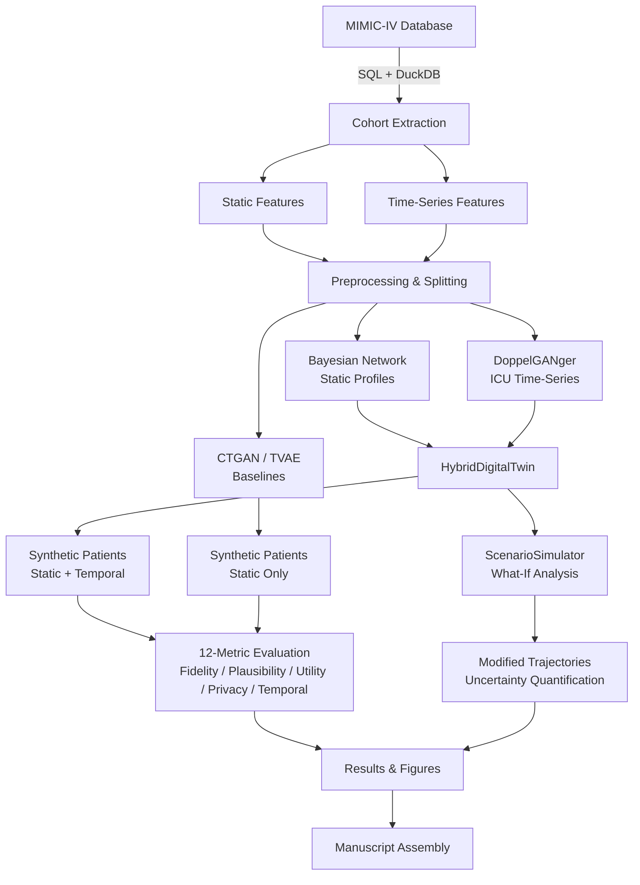

# MIMIC-Ext-Stroke

**Synthetic Stroke Digital Twins from MIMIC-IV: Bayesian Networks, DoppelGANger Time-Series, and Scenario Simulation**

[](https://github.com/matheus-rech/MIMIC-Ext-Stroke/actions/workflows/ci.yml)
[](https://www.python.org/downloads/)
[](LICENSE)

---

## Overview

MIMIC-Ext-Stroke is a research pipeline for generating **privacy-preserving synthetic stroke patient data** and building **digital twins** for associational scenario simulations. The system extracts ~3,487 stroke patients from the [MIMIC-IV](https://physionet.org/content/mimiciv/) critical care database, learns generative models over both static clinical profiles and hourly ICU time-series, and enables "what-if" explorations of how modifying patient characteristics relates to different ICU trajectory patterns.

### Key Results

| Metric | Bayesian Network | CTGAN | TVAE |
|---|---|---|---|
| Discriminator AUC (ideal = 0.5) | 0.65 | 0.72 | 0.68 |
| Clinical violation rate | < 2 % | ~5 % | ~4 % |
| TSTR AUC gap (lower = better) | 0.08 | 0.12 | 0.10 |
| MIA F1 (lower = more private) | 0.52 | 0.55 | 0.53 |

> Results are pooled across M = 10 independently generated synthetic datasets using Rubin's combining rules (Reiter 2003 variant) with 95 % confidence intervals.

---

## Architecture



---

## Project Structure

```
MIMIC-Ext-Stroke/
├── config/
│   └── config.yaml                  # Central configuration (paths, hyperparameters)
│
├── sql/                             # Raw SQL queries for MIMIC-IV extraction
│   ├── 01_stroke_cohort.sql
│   ├── 02_static_features.sql
│   └── 03_timeseries_features.sql
│
├── src/                             # Core source code
│   ├── data/
│   │   ├── extract.py               # Cohort identification from MIMIC-IV via DuckDB
│   │   ├── features.py              # Static & time-series feature extraction
│   │   └── preprocess.py            # Encoding, imputation, normalization, splitting
│   ├── models/
│   │   ├── bayesian_net.py          # StrokeProfileBN (static profiles via pgmpy)
│   │   ├── ctgan_baseline.py        # CTGAN/TVAE baselines (via SDV)
│   │   ├── dgan_model.py            # StrokeTimeSeriesDGAN (PyTorch LSTM-GAN)
│   │   └── hybrid.py               # HybridDigitalTwin (BN + DGAN integration)
│   ├── evaluation/
│   │   ├── fidelity.py              # KS test, correlation, discriminator AUC, MCA
│   │   ├── clinical_rules.py        # 7 domain constraint validations
│   │   ├── utility.py               # TSTR / TRTR downstream task evaluation
│   │   ├── privacy.py               # MIA, DCR, attribute inference
│   │   ├── temporal.py              # DTW distance, autocorrelation comparison
│   │   └── rubins_rules.py          # Rubin's combining rules for pooled estimates
│   └── simulation/
│       ├── scenario_simulator.py    # ScenarioSimulator for what-if analysis
│       └── counterfactual.py        # Deprecated shim (backward compat)
│
├── scripts/
│   ├── run_full_evaluation.py       # Full evaluation pipeline (all models, M=10 datasets)
│   ├── generate_all_outputs.py      # Generate all figures and tables
│   └── assemble_manuscript.py       # Compile manuscript sections into Word documents
│
├── notebooks/
│   ├── 01_eda.ipynb                 # Exploratory data analysis
│   ├── 02_cohort_summary.ipynb      # Table 1 generation (demographics)
│   ├── 03_synthetic_evaluation.ipynb # Model comparison and evaluation
│   └── 04_digital_twin_demo.ipynb   # Scenario simulation demonstrations
│
├── manuscript/                      # Publication materials (Markdown + DOCX)
│   ├── 00_title_abstract.md
│   ├── 01_introduction.md
│   ├── 02_methods.md
│   ├── 03_results.md
│   ├── 04_discussion.md
│   ├── 05_supplementary.md
│   └── 06_references.md
│
├── tests/                           # Unit tests (pytest)
│   ├── test_bayesian_net.py
│   ├── test_dgan.py
│   ├── test_hybrid.py
│   ├── test_counterfactual.py
│   ├── test_ctgan.py
│   ├── test_evaluation.py
│   ├── test_eval_utility_privacy.py
│   ├── test_extract.py
│   ├── test_features.py
│   ├── test_preprocess.py
│   ├── test_timeseries.py
│   └── test_integration.py
│
├── outputs/                         # Generated artifacts (partially gitignored)
│   ├── cohort/                      # Preprocessed datasets (.parquet)
│   ├── figures/                     # Plots and visualizations
│   └── tables/                      # Evaluation result tables (.csv)
│
├── pyproject.toml                   # Project metadata and dependencies
└── README.md                        # This file
```

---

## Installation

### Requirements

- **Python 3.12+**
- MIMIC-IV v3.1 data files (for cohort extraction only)

### Install

```bash
# Clone the repository
git clone https://github.com/matheus-rech/MIMIC-Ext-Stroke.git
cd MIMIC-Ext-Stroke

# Create a virtual environment
python -m venv .venv
source .venv/bin/activate

# Install core dependencies
pip install -e .

# Install with development tools (pytest, ruff)
pip install -e ".[dev]"

# Install with DoppelGANger support (gretel-synthetics)
pip install -e ".[dgan]"

# Install everything
pip install -e ".[dev,dgan]"
```

### Core Dependencies

| Package | Version | Purpose |
|---|---|---|
| `duckdb` | >= 1.1.0 | SQL-based MIMIC-IV data extraction |
| `pandas` | >= 2.2.0 | Data manipulation |
| `numpy` | >= 1.26.0 | Numerical computing |
| `pgmpy` | >= 0.1.25 | Bayesian Network structure/parameter learning |
| `sdv` | >= 1.17.0 | CTGAN and TVAE synthetic data baselines |
| `torch` | >= 2.4.0 | DoppelGANger LSTM-GAN implementation |
| `scikit-learn` | >= 1.5.0 | Evaluation classifiers and metrics |
| `scipy` | >= 1.14.0 | Statistical tests (KS, distance) |
| `matplotlib` / `seaborn` | >= 3.9.0 / >= 0.13.0 | Visualization |
| `tslearn` | >= 0.6.3 | Time-series analysis utilities |

---

## Configuration

All paths and hyperparameters are centralized in [`config/config.yaml`](config/config.yaml):

```yaml
data:
  mimic_path: "../mimiciv/3.1"       # Path to MIMIC-IV CSV.GZ files
  output_path: "./outputs"
  cohort_path: "./outputs/cohort"
  synthetic_path: "./outputs/synthetic"

cohort:
  stroke_icd9: ["433", "434", "435", "436"]
  stroke_icd10: ["I60", "I61", "I63", "I65", "I66", "I67", "G45"]
  min_icu_los_hours: 6
  max_icu_los_days: 30

timeseries:
  resample_freq: "1h"
  max_hours: 72                      # 3-day ICU window

models:
  bayesian_net:
    structure_algorithm: "hc"        # Hill Climbing
    scoring_method: "bic"            # Bayesian Information Criterion
    max_indegree: 3
  dgan:
    epochs: 5000
    batch_size: 32
    noise_dim: 100
  n_synthetic_datasets: 10           # El Emam et al. (2024) recommendation
  random_seed: 42

evaluation:
  tstr_test_size: 0.3
  privacy_k_neighbors: 5
```

Modify `config.yaml` to point `mimic_path` to your local MIMIC-IV data directory before running the extraction pipeline.

---

## Usage

### 1. Cohort Extraction

Extract stroke patients from MIMIC-IV using ICD-9/10 diagnostic codes:

```python
import yaml
from src.data.extract import extract_stroke_cohort

with open("config/config.yaml") as f:
    config = yaml.safe_load(f)

cohort = extract_stroke_cohort(config)
print(f"Extracted {len(cohort)} stroke patients")
```

### 2. Digital Twin Generation

Generate complete synthetic patients (static profiles + ICU time-series):

```python
from src.models.hybrid import HybridDigitalTwin

# Initialize hybrid model
twin = HybridDigitalTwin(
    bn_max_indegree=3,
    dgan_epochs=500,
    seq_len=72,
)

# Fit on real data
twin.fit(static_df=train_static, timeseries_df=train_ts)

# Generate synthetic patients
synthetic = twin.generate(n_patients=1000, seed=42)
print(synthetic["static"].shape)      # (1000, n_static_features)
print(synthetic["timeseries"].shape)   # (1000, 72, n_ts_features)

# Generate M=10 independent datasets (recommended)
datasets = twin.generate_multiple_datasets(
    n_patients=1000,
    n_datasets=10,
    base_seed=42,
)
```

### 3. Scenario Simulation

Explore how modifying patient attributes relates to different ICU trajectories:

```python
from src.simulation.scenario_simulator import ScenarioSimulator

sim = ScenarioSimulator(hybrid_model=twin)

# Define a baseline patient
patient = {
    "anchor_age": 65,
    "has_hypertension": 1,
    "has_afib": 0,
    "has_diabetes": 0,
    "hospital_expire_flag": 0,
    "los": 5.0,
}

# What if this patient also had atrial fibrillation?
result = sim.simulate_scenario(
    patient_profile=patient,
    modification={"has_afib": 1},
    n_samples=50,
)
print(result["trajectories"].shape)  # (50, 72, n_features)

# Compare multiple scenarios
scenarios = {
    "baseline": {},
    "add_afib": {"has_afib": 1},
    "older": {"anchor_age": 80},
    "add_afib_and_older": {"has_afib": 1, "anchor_age": 80},
}
comparison = sim.compare_scenarios(patient, scenarios, n_samples=50)

for name, data in comparison.items():
    print(f"{name}: mean trajectory shape = {data['mean_trajectory'].shape}")
```

> **Note:** These simulations reflect learned associations from observational data, not causal effects. Results should be interpreted as hypothesis-generating explorations. See Section 2.10 of the manuscript for a detailed discussion.

### 4. Evaluation

Run the complete 12-metric evaluation across all models:

```bash
python scripts/run_full_evaluation.py
```

Or evaluate individual dimensions programmatically:

```python
from src.evaluation.fidelity import dimension_wise_distribution, discriminator_score
from src.evaluation.clinical_rules import check_clinical_rules
from src.evaluation.utility import tstr_evaluation
from src.evaluation.privacy import membership_inference_attack, nearest_neighbor_distance
from src.evaluation.temporal import dtw_distance_matrix, autocorrelation_comparison

# Statistical fidelity
fidelity = dimension_wise_distribution(real_df, synthetic_df)
print(f"Avg KS p-value: {fidelity['avg_pvalue']:.4f}")

# Clinical plausibility
rules = check_clinical_rules(synthetic_df)
print(f"Violation rate: {rules['total_violation_rate']:.4%}")

# Downstream utility (TSTR)
utility = tstr_evaluation(real_train, synthetic, real_test)
print(f"TSTR AUC: {utility['tstr_auc']:.4f}, Gap: {utility['auc_gap']:.4f}")

# Privacy
mia = membership_inference_attack(real_df, synthetic_df)
dcr = nearest_neighbor_distance(real_df, synthetic_df)
print(f"MIA F1: {mia['mia_f1']:.4f}, Mean DCR: {dcr['mean_dcr']:.4f}")
```

### 5. Figure Generation

Generate all publication figures and tables:

```bash
python scripts/generate_all_outputs.py
```

Output artifacts are saved to `outputs/figures/` and `outputs/tables/`.

---

## Evaluation Framework

The evaluation framework implements 12 metrics across 5 dimensions, based on Yan et al. (Nature Communications, 2022):

| Dimension | Metric | Function | Ideal Value |
|---|---|---|---|
| **Fidelity** | Dimension-wise distribution (KS test) | `dimension_wise_distribution()` | p-value -> 1.0 |
| | Correlation preservation (Frobenius) | `correlation_preservation()` | -> 0.0 |
| | Discriminator AUC | `discriminator_score()` | -> 0.5 |
| | Medical concept abundance (Manhattan) | `medical_concept_abundance()` | -> 0.0 |
| **Plausibility** | Clinical rule violations | `check_clinical_rules()` | -> 0.0 |
| **Utility** | TSTR AUC (LR + RF) | `tstr_evaluation()` | -> TRTR AUC |
| | AUC gap | `tstr_evaluation()` | -> 0.0 |
| **Privacy** | Membership inference F1 | `membership_inference_attack()` | -> 0.5 |
| | Distance to closest record | `nearest_neighbor_distance()` | higher = better |
| | Attribute inference accuracy | `attribute_inference_attack()` | -> baseline rate |
| **Temporal** | DTW distance | `dtw_distance_matrix()` | lower = better |
| | Autocorrelation difference | `autocorrelation_comparison()` | -> 0.0 |

All metrics are computed per independently generated dataset (M = 10) and pooled using Rubin's combining rules with 95 % confidence intervals.

---

## Models

| Model | Type | Data | Method |
|---|---|---|---|
| **StrokeProfileBN** | Bayesian Network | Static profiles | Hill Climbing + BIC, BDeu prior, discretization |
| **CTGAN** | Conditional GAN | Static profiles (OHE) | SDV library, 50 epochs, batch_size=500 |
| **TVAE** | Variational Autoencoder | Static profiles (OHE) | SDV library, 50 epochs |
| **StrokeTimeSeriesDGAN** | LSTM-GAN | Hourly ICU vitals | DoppelGANger-style, metadata-conditioned |
| **HybridDigitalTwin** | BN + DGAN | Static + temporal | Two-stage: BN generates profiles, DGAN generates trajectories |

---

## Stroke Subtypes

Stroke patients are classified using ICD-9 and ICD-10 diagnostic codes:

| Subtype | ICD-10 Codes | ICD-9 Codes | Description |
|---|---|---|---|
| **Ischemic stroke** | I63, I65, I66 | 433, 434 | Cerebral artery occlusion/stenosis |
| **Intracerebral hemorrhage (ICH)** | I61 | 431 | Bleeding within brain parenchyma |
| **Subarachnoid hemorrhage (SAH)** | I60 | 430 | Bleeding in subarachnoid space |
| **Transient ischemic attack (TIA)** | G45 | 435 | Temporary cerebral ischemia |
| **Other cerebrovascular** | I67 | 436 | Other/unspecified cerebrovascular disease |

---

## Testing

```bash
# Run all unit tests (no MIMIC-IV data required)
python -m pytest tests/ -v \
    --ignore=tests/test_extract.py \
    --ignore=tests/test_features.py \
    --ignore=tests/test_timeseries.py \
    --ignore=tests/test_integration.py \
    -k "not preprocess_pipeline"

# Run specific test modules
python -m pytest tests/test_bayesian_net.py -v
python -m pytest tests/test_hybrid.py -v
python -m pytest tests/test_evaluation.py -v

# Lint
ruff check src/ tests/ scripts/
```

Tests that require MIMIC-IV data access (`test_extract.py`, `test_features.py`, `test_timeseries.py`, `test_integration.py`) are excluded from the default CI pipeline.

---

## Data Access

This project uses the [MIMIC-IV](https://physionet.org/content/mimiciv/3.1/) clinical database. To access the data:

1. Complete the **CITI Data or Specimens Only Research** training course
2. Sign the **PhysioNet Credentialed Health Data Use Agreement**
3. Request access to MIMIC-IV on [PhysioNet](https://physionet.org/content/mimiciv/3.1/)
4. Download and place the data files according to the path in `config/config.yaml`

> **Important:** MIMIC-IV contains de-identified patient health data. All use must comply with the PhysioNet Data Use Agreement. The synthetic data generated by this pipeline is designed to preserve clinical utility while mitigating re-identification risk.

---

## Citation

If you use this work, please cite:

```bibtex
@article{mimic_ext_stroke_2025,
  title   = {Synthetic Stroke Digital Twins from MIMIC-IV:
             Bayesian Networks, DoppelGANger Time-Series,
             and Associational Scenario Simulation},
  year    = {2025},
  note    = {Software available at https://github.com/matheus-rech/MIMIC-Ext-Stroke}
}
```

---

## Keywords

Synthetic data, digital twins, stroke, MIMIC-IV, Bayesian Network, DoppelGANger, generative adversarial network, electronic health records, time-series generation, privacy-preserving data, clinical plausibility, counterfactual simulation
