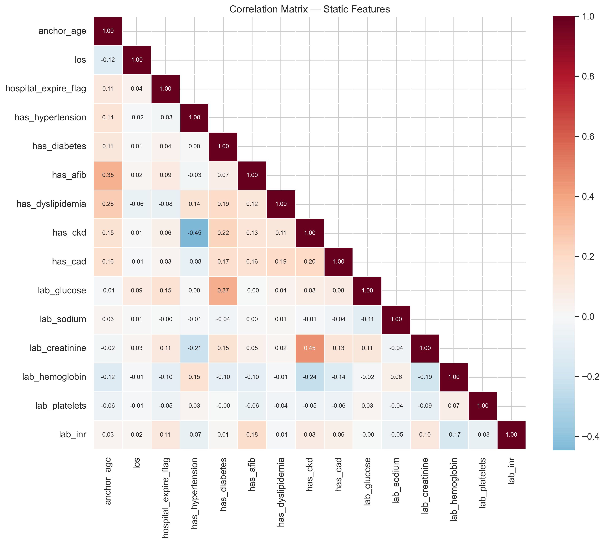
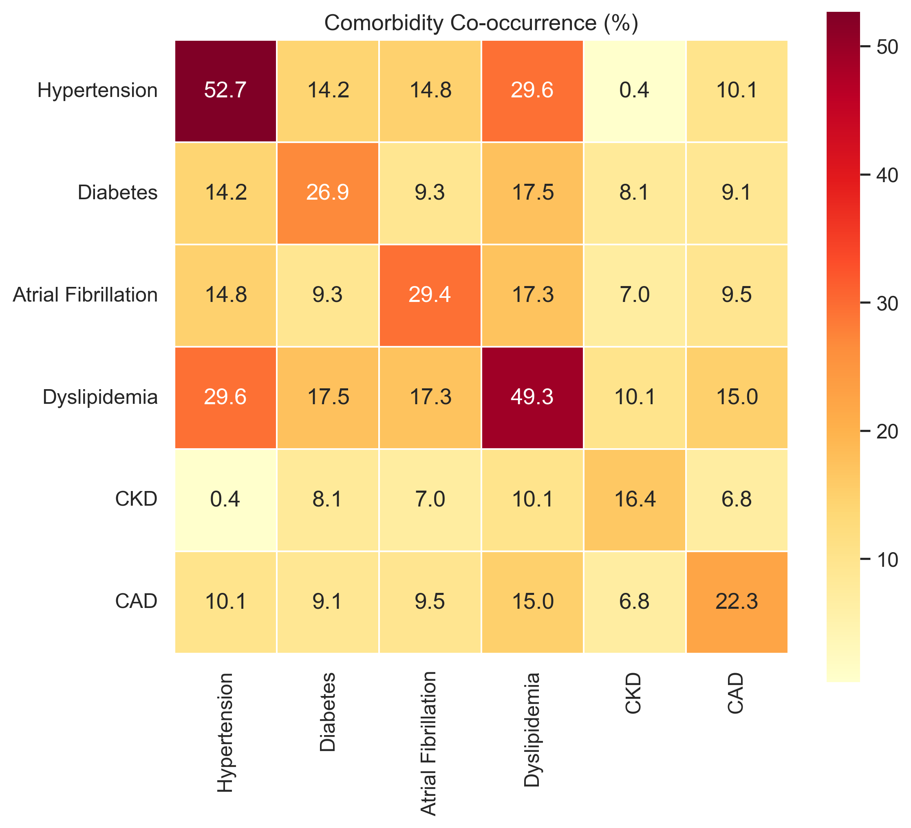
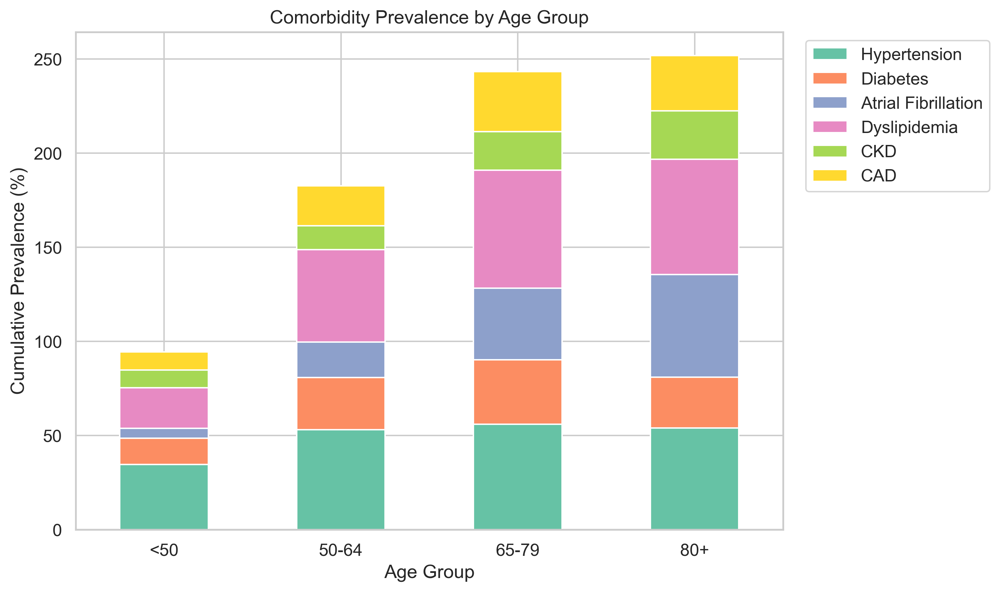
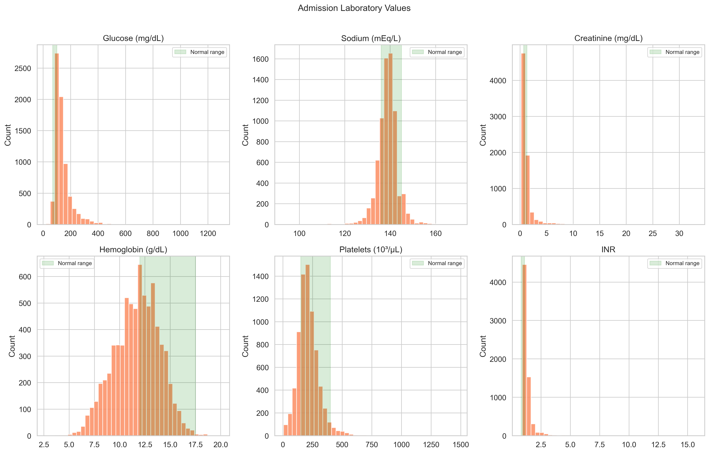
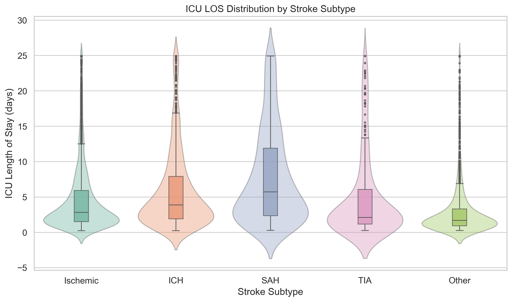
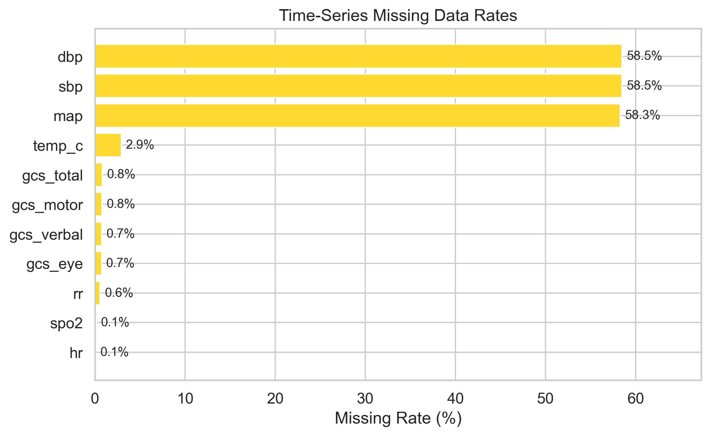
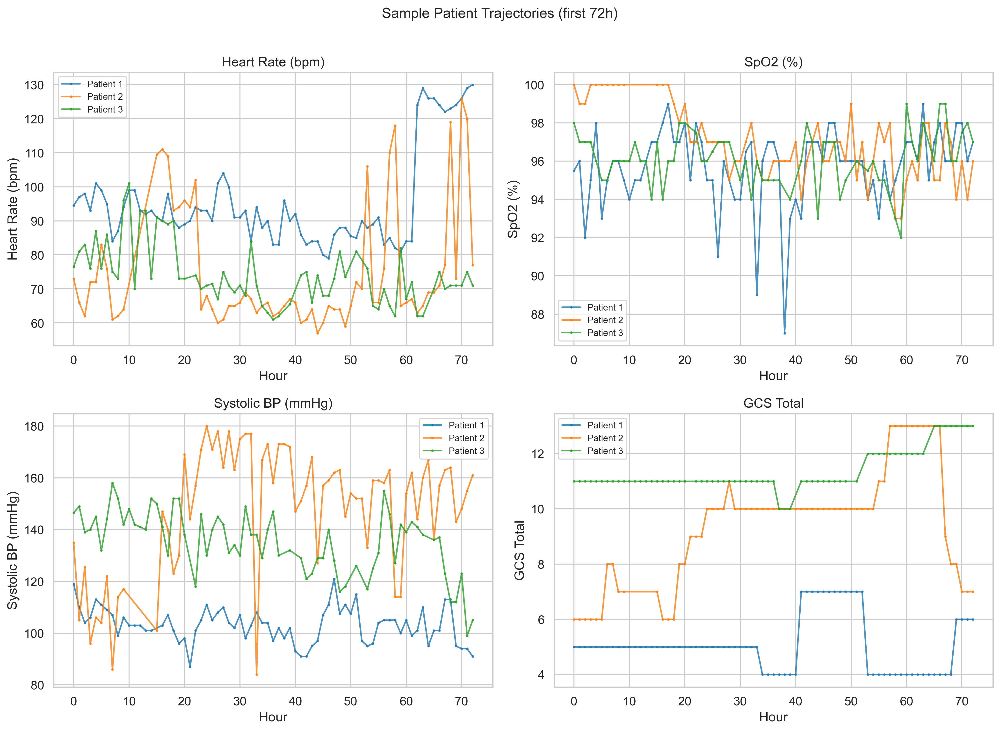
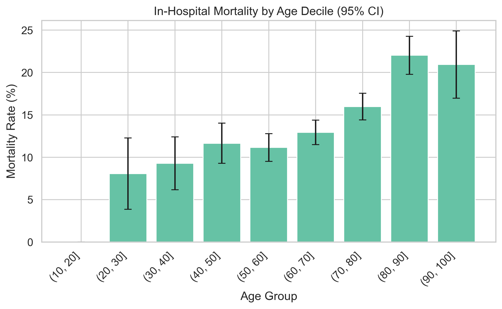

# Supplementary Materials

**Stroke Digital Twin: A Multi-Model Synthetic Data Framework from MIMIC-IV v3.1**

---

## Supplementary Table S1: ICD Code Definitions for Cohort Selection

### Stroke Diagnosis Codes

| ICD Version | Code Prefix | Description |
|:-----------:|:-----------:|:------------|
| ICD-9 | 433.xx | Occlusion and stenosis of precerebral arteries |
| ICD-9 | 434.xx | Occlusion of cerebral arteries |
| ICD-9 | 435.xx | Transient cerebral ischemia |
| ICD-9 | 436 | Acute, but ill-defined, cerebrovascular disease |
| ICD-10 | I60.xx | Nontraumatic subarachnoid hemorrhage |
| ICD-10 | I61.xx | Nontraumatic intracerebral hemorrhage |
| ICD-10 | I63.xx | Cerebral infarction |
| ICD-10 | I65.xx | Occlusion and stenosis of precerebral arteries, not resulting in cerebral infarction |
| ICD-10 | I66.xx | Occlusion and stenosis of cerebral arteries, not resulting in cerebral infarction |
| ICD-10 | I67.xx | Other cerebrovascular diseases |
| ICD-10 | G45.xx | Transient cerebral ischemic attacks and related syndromes |

### Stroke Subtype Classification Logic

Stroke subtype was assigned from the primary (lowest `seq_num`) stroke ICD code on the index admission:

| Subtype | ICD-10 Codes | ICD-9 Codes |
|:--------|:-------------|:------------|
| Ischemic | I63.xx | 433.xx, 434.xx |
| Intracerebral hemorrhage (ICH) | I61.xx | -- |
| Subarachnoid hemorrhage (SAH) | I60.xx | -- |
| Transient ischemic attack (TIA) | G45.xx | 435.xx |
| Other cerebrovascular | I65.xx, I66.xx, I67.xx | 436 |

### Comorbidity ICD Codes

| Comorbidity | ICD-9 Codes | ICD-10 Codes |
|:------------|:------------|:-------------|
| Hypertension | 401.xx | I10.xx |
| Diabetes mellitus | 250.xx | E11.xx |
| Atrial fibrillation | 4273.x | I48.xx |
| Dyslipidemia | 272.xx | E78.xx |
| Chronic kidney disease (CKD) | 585.xx | N18.xx |
| Coronary artery disease (CAD) | 410.xx, 412.xx | I21.xx, I25.xx |

---

## Supplementary Table S2: Cohort Characteristics by Stroke Subtype

| Variable | Statistic | Ischemic (n = 4,398) | ICH (n = 1,397) | SAH (n = 436) | TIA (n = 282) | Other (n = 1,987) | p-value |
|:---------|:----------|:---------------------:|:----------------:|:--------------:|:--------------:|:------------------:|:-------:|
| **Age (years)** | Median (IQR) | 70.0 (59.0--80.0) | 69.0 (58.0--80.0) | 62.0 (51.0--73.0) | 68.0 (55.0--77.8) | 66.0 (56.0--75.0) | <0.001 |
| **Female sex** | n (%) | 2,091 (47.5) | 668 (47.8) | 246 (56.4) | 137 (48.6) | 1,116 (56.2) | <0.001 |
| **Hypertension** | n (%) | 2,277 (51.8) | 817 (58.5) | 227 (52.1) | 131 (46.5) | 940 (47.3) | <0.001 |
| **Diabetes** | n (%) | 1,429 (32.5) | 349 (25.0) | 63 (14.4) | 78 (27.7) | 469 (23.6) | <0.001 |
| **Atrial fibrillation** | n (%) | 1,703 (38.7) | 386 (27.6) | 68 (15.6) | 75 (26.6) | 424 (21.3) | <0.001 |
| **Dyslipidemia** | n (%) | 2,459 (55.9) | 647 (46.3) | 155 (35.6) | 154 (54.6) | 1,069 (53.8) | <0.001 |
| **CKD** | n (%) | 897 (20.4) | 209 (15.0) | 36 (8.3) | 56 (19.9) | 314 (15.8) | <0.001 |
| **CAD** | n (%) | 1,121 (25.5) | 258 (18.5) | 58 (13.3) | 75 (26.6) | 629 (31.7) | <0.001 |
| **Glucose (mg/dL)** | Median (IQR) | 123.0 (101.0--157.0) | 123.0 (103.0--151.0) | 126.0 (105.0--155.0) | 117.5 (100.0--150.2) | 121.0 (98.0--154.0) | 0.062 |
| **Sodium (mEq/L)** | Median (IQR) | 139.0 (137.0--141.0) | 140.0 (137.0--142.0) | 139.0 (137.0--142.0) | 139.0 (137.0--141.0) | 139.0 (137.0--141.0) | <0.001 |
| **Creatinine (mg/dL)** | Median (IQR) | 1.0 (0.8--1.3) | 0.9 (0.7--1.1) | 0.8 (0.7--1.0) | 0.9 (0.7--1.2) | 0.9 (0.7--1.2) | <0.001 |
| **Hemoglobin (g/dL)** | Median (IQR) | 11.8 (10.1--13.3) | 12.2 (10.8--13.5) | 12.2 (11.0--13.5) | 11.8 (10.2--13.2) | 11.7 (10.0--13.2) | <0.001 |
| **Platelets (10^3/uL)** | Median (IQR) | 207.0 (158.0--264.0) | 203.0 (158.0--254.8) | 205.0 (169.0--248.0) | 199.5 (158.2--258.5) | 202.0 (157.8--254.0) | 0.230 |
| **INR** | Median (IQR) | 1.2 (1.1--1.4) | 1.1 (1.1--1.3) | 1.1 (1.1--1.2) | 1.1 (1.1--1.3) | 1.1 (1.1--1.3) | <0.001 |
| **ICU LOS (days)** | Median (IQR) | 2.8 (1.5--5.9) | 3.9 (1.9--7.9) | 5.7 (2.4--11.9) | 2.1 (1.2--6.1) | 1.7 (0.9--3.3) | <0.001 |
| **In-hospital mortality** | n (%) | 746 (17.0) | 307 (22.0) | 91 (20.9) | 17 (6.0) | 97 (4.9) | <0.001 |

Continuous variables are reported as median (interquartile range). Categorical variables are reported as n (%). P-values were computed using the Kruskal-Wallis test for continuous variables and the chi-squared test for categorical variables across all five stroke subtypes.

---

## Supplementary Table S3: Comorbidity Co-occurrence Matrix

Prevalence of comorbidity pairs (% of total cohort, N = 8,500). Diagonal entries represent overall prevalence of each individual comorbidity.

| | Hypertension | Diabetes | Atrial Fibrillation | Dyslipidemia | CKD | CAD |
|:--|:-----------:|:--------:|:-------------------:|:------------:|:---:|:---:|
| **Hypertension** | **51.7** | 14.3 | 15.2 | 30.9 | 0.4 | 11.2 |
| **Diabetes** | 14.3 | **28.1** | 10.1 | 19.0 | 8.9 | 10.4 |
| **Atrial fibrillation** | 15.2 | 10.1 | **31.2** | 19.4 | 7.8 | 10.9 |
| **Dyslipidemia** | 30.9 | 19.0 | 19.4 | **52.8** | 11.4 | 17.2 |
| **CKD** | 0.4 | 8.9 | 7.8 | 11.4 | **17.8** | 7.7 |
| **CAD** | 11.2 | 10.4 | 10.9 | 17.2 | 7.7 | **25.2** |

The most frequent comorbidity pair was hypertension--dyslipidemia (30.9%), followed by dyslipidemia--atrial fibrillation (19.4%) and diabetes--dyslipidemia (19.0%). Notably, hypertension--CKD co-occurrence was low (0.4%), likely reflecting coding patterns rather than true clinical independence.

---

## Supplementary Table S4: MIMIC-IV Item IDs

### Chartevents (ICU Time-Series)

| Variable | Item ID | MIMIC-IV Label | Unit | Source Table |
|:---------|:-------:|:---------------|:-----|:-------------|
| Heart rate | 220045 | Heart Rate | bpm | chartevents |
| Systolic blood pressure | 220050 | Arterial Blood Pressure systolic | mmHg | chartevents |
| Diastolic blood pressure | 220051 | Arterial Blood Pressure diastolic | mmHg | chartevents |
| Mean arterial pressure | 220052 | Arterial Blood Pressure mean | mmHg | chartevents |
| Respiratory rate | 220210 | Respiratory Rate | breaths/min | chartevents |
| SpO2 | 220277 | SpO2 | % | chartevents |
| Temperature (Celsius) | 223762 | Temperature Celsius | C | chartevents |
| Temperature (Fahrenheit) | 223761 | Temperature Fahrenheit | F | chartevents |
| GCS -- Eye opening | 220739 | GCS - Eye Opening | score | chartevents |
| GCS -- Verbal response | 223900 | GCS - Verbal Response | score | chartevents |
| GCS -- Motor response | 223901 | GCS - Motor Response | score | chartevents |

Fahrenheit temperatures were converted to Celsius using: T_C = (T_F - 32) x 5/9. GCS total was computed as the sum of eye, verbal, and motor subscores.

### Labevents (Admission Labs)

| Variable | Item ID | MIMIC-IV Label | Unit | Source Table |
|:---------|:-------:|:---------------|:-----|:-------------|
| Glucose | 50931 | Glucose | mg/dL | labevents |
| Sodium | 50983 | Sodium | mEq/L | labevents |
| Creatinine | 50912 | Creatinine | mg/dL | labevents |
| Hemoglobin | 51222 | Hemoglobin | g/dL | labevents |
| Platelets | 51265 | Platelet Count | 10^3/uL | labevents |
| INR | 51237 | INR(PT) | ratio | labevents |

Additional lab item IDs referenced in the configuration but not used in the static feature extraction: potassium (50971), BUN (51006), WBC (51301), lactate (50813).

Only the first value recorded within 24 hours of hospital admission was retained for each lab test.

---

## Supplementary Table S5: Model Hyperparameters

### Bayesian Network (Static Profile Generation)

| Parameter | Value | Description |
|:----------|:------|:------------|
| Structure learning algorithm | Hill Climbing (`hc`) | Greedy local search over DAG space |
| Scoring method | BIC (Bayesian Information Criterion) | Penalizes complexity to prevent overfitting |
| Maximum indegree | 3 | Maximum number of parents per node |
| Prior type | BDeu (Bayesian Dirichlet equivalent uniform) | Smoothing prior for parameter estimation |
| Equivalent sample size | 10 | Strength of the BDeu prior |
| Number of features | 17 | Discretized age, gender, stroke subtype, LOS, mortality, 6 comorbidities, 6 labs |
| Age discretization | 6 bins: 18--45, 45--55, 55--65, 65--75, 75--85, 85+ | Expert-defined clinically meaningful age groups |
| LOS discretization | 5 bins: 0--1d, 1--3d, 3--7d, 7--14d, 14+d | Expert-defined length-of-stay categories |
| Lab discretization | Quartile-based (4 bins per lab) | Data-driven boundaries computed from training data |
| Inverse discretization | Uniform random within bin range | Midpoint + noise to recover continuous values |

### DGAN (ICU Time-Series Generation)

| Parameter | Value | Description |
|:----------|:------|:------------|
| Architecture | LSTM-based Generator + Discriminator | 2-layer LSTM in both networks |
| Epochs | 5,000 | Training iterations (from config) |
| Batch size | 32 | Samples per gradient update |
| Hidden dimension | 128 | LSTM hidden state size |
| Noise dimension | 100 | Input noise vector dimensionality |
| Number of LSTM layers | 2 | Depth of recurrent networks |
| Learning rate | 0.0002 | Adam optimizer with betas (0.5, 0.999) |
| Sample length | 6 | Sequence chunk length |
| Loss function | BCEWithLogitsLoss | Binary cross-entropy with logits |
| Generator output activation | Tanh | Output scaled to [-1, 1] |
| Discriminator architecture | LSTM encoder + metadata MLP + classifier | Separate sequence and metadata embeddings |
| Device priority | MPS > CUDA > CPU | Apple Silicon acceleration when available |

### CTGAN and TVAE (SDV Baselines)

| Parameter | Value | Description |
|:----------|:------|:------------|
| CTGAN epochs | 300 (SDV default) | Training iterations |
| CTGAN batch size | 500 (SDV default) | Samples per gradient update |
| CTGAN generator dimensions | (256, 256) | Two hidden layers |
| CTGAN discriminator dimensions | (256, 256) | Two hidden layers |
| TVAE epochs | 300 (SDV default) | Training iterations |
| TVAE compress dimensions | (128, 128) | Encoder hidden layers |
| TVAE decompress dimensions | (128, 128) | Decoder hidden layers |

### General Settings

| Parameter | Value |
|:----------|:------|
| Number of synthetic datasets | 10 |
| Random seed | 42 |
| TSTR test split | 0.3 |
| Privacy k-neighbors | 5 |
| t-SNE perplexities | 15, 25, 50 |
| Time-series resampling frequency | 1 hour |
| Maximum time-series duration | 72 hours |

---

## Supplementary Table S6: Clinical Plausibility Rules

Seven domain-specific rules were used to evaluate the clinical plausibility of synthetic patient records. A synthetic record was flagged as implausible if it violated any rule.

| Rule ID | Rule Name | Variable(s) | Acceptable Range | Clinical Rationale |
|:-------:|:----------|:------------|:-----------------|:-------------------|
| R1 | Age validity | `anchor_age` | 18--120 years | Adult ICU population; upper bound accommodates MIMIC-IV age-shifting |
| R2 | GCS validity | `gcs_total` | 3--15 | GCS scale is bounded at 3 (minimum) and 15 (maximum) by definition |
| R3 | LOS positivity | `los` | > 0 days | ICU length of stay must be strictly positive |
| R4 | SBP > DBP | `sbp`, `dbp` | SBP > DBP | Systolic pressure must exceed diastolic pressure under normal physiology |
| R5 | SpO2 range | `spo2` | 50--100% | Oxygen saturation below 50% is incompatible with ICU survival; maximum is 100% |
| R6 | Heart rate range | `hr` | 20--300 bpm | Encompasses extreme bradycardia to supraventricular tachycardia |
| R7 | Temperature range | `temp_c` | 30--45 C | Encompasses severe hypothermia to extreme hyperthermia |

The total clinical violation rate was computed as: total violations / (N_records x N_rules). Individual rule violation rates were computed per-rule as: violations / N_records. Rules were applied identically to both real and synthetic datasets to enable direct comparison.

---

## Supplementary Figure S1: Correlation Heatmap of Static Features

**Supplementary Figure S1.** Pearson correlation matrix of all 15 static features (continuous and binary) in the stroke cohort (N = 8,500). Notable positive correlations include age--atrial fibrillation (r = 0.36), dyslipidemia--hypertension (r = 0.19), and creatinine--CKD (r = 0.22). Negative correlations include age--hemoglobin (r = -0.12) and hemoglobin--INR (r = -0.19). The relatively modest inter-feature correlations (all |r| < 0.45) indicate that simple marginal matching would be insufficient; the Bayesian Network captures higher-order conditional dependencies among these variables.

---

## Supplementary Figure S2: Comorbidity Co-occurrence Heatmap

**Supplementary Figure S2.** Heatmap of pairwise comorbidity co-occurrence rates (% of total cohort, N = 8,500). Diagonal entries represent the marginal prevalence of each comorbidity. Dyslipidemia (52.8%) and hypertension (51.7%) were the most prevalent individual comorbidities, and their co-occurrence rate (30.9%) was the highest pairwise combination, consistent with their known shared pathophysiological mechanisms in cerebrovascular disease.

---

## Supplementary Figure S3: Age-Stratified Comorbidity Prevalence

**Supplementary Figure S3.** Stacked bar chart of comorbidity prevalence across four age groups (<50, 50--64, 65--79, 80+ years). All six comorbidities demonstrated increasing cumulative prevalence with age, with the 80+ group accumulating approximately 250% total comorbidity burden (reflecting multimorbidity). Atrial fibrillation showed the steepest age-related increase, rising from approximately 5% in the <50 group to over 50% in the 80+ group. This age-dependent multimorbidity pattern was a key relationship that the Bayesian Network was designed to capture.

---

## Supplementary Figure S4: Admission Laboratory Value Distributions

**Supplementary Figure S4.** Histograms of six admission laboratory values with reference normal ranges (green shading). Glucose showed a right-skewed distribution with median 123.0 mg/dL (IQR 101.0--155.0), reflecting stress hyperglycemia common in acute stroke. Sodium was approximately normally distributed. Creatinine and INR were right-skewed with long tails. Hemoglobin followed a near-normal distribution centered at 11.9 g/dL. Missing data rates ranged from 12.5% (creatinine) to 22.4% (INR); see cohort summary statistics.

---

## Supplementary Figure S5: ICU Length of Stay Distribution by Stroke Subtype

**Supplementary Figure S5.** Violin plots of ICU length of stay (days) by stroke subtype. SAH patients had the longest median ICU stay (5.7 days; IQR 2.4--11.9), reflecting the severity and monitoring requirements of subarachnoid hemorrhage. ICH patients had the second-longest stay (3.9 days; IQR 1.9--7.9). Ischemic stroke patients had a median stay of 2.8 days (IQR 1.5--5.9). The "Other" cerebrovascular category had the shortest stays (1.7 days; IQR 0.9--3.3). All distributions were right-skewed with long tails extending to the 30-day cohort inclusion maximum. Kruskal-Wallis p < 0.001.

---

## Supplementary Figure S6: Time-Series Missing Data Rates

**Supplementary Figure S6.** Hourly time-series missing data rates after resampling to 1-hour resolution over 72 hours. Blood pressure variables (SBP, DBP, MAP) had the highest missing rates at approximately 58.5%, reflecting that arterial lines were not universally placed. Temperature had a moderate missing rate (2.9%). GCS components (eye, verbal, motor) and respiratory rate had low missing rates (<1%). Heart rate and SpO2, as continuously monitored signals, had the lowest missing rates (0.1%). These differential missing patterns were addressed via forward-fill imputation prior to DGAN training.

---

## Supplementary Figure S7: Sample Patient ICU Trajectories

**Supplementary Figure S7.** Example 72-hour ICU trajectories for three representative patients showing heart rate (bpm), SpO2 (%), systolic blood pressure (mmHg), and GCS total score. Patient 1 (blue) demonstrated hemodynamic stability with preserved consciousness (GCS 14--15). Patient 2 (orange) showed intermittent hypotension with declining SpO2. Patient 3 (green) exhibited a persistently low GCS (3--4), consistent with severe neurological injury. These trajectories illustrate the temporal dynamics and inter-patient variability that the DGAN model was designed to replicate.

---

## Supplementary Figure S8: In-Hospital Mortality by Age Decile

**Supplementary Figure S8.** In-hospital mortality rate by age decile with 95% confidence intervals. Mortality increased monotonically from 8.0% in the 20--30 age group to 22.0% in the 80--90 age group, plateauing slightly at 21.0% in the 90--100 group. The absence of patients in the 10--20 age decile reflects the adult-only (age >= 18) inclusion criterion. The wide confidence intervals in the youngest age groups reflect smaller sample sizes. This age--mortality gradient was captured by the Bayesian Network through the learned edge between discretized age and hospital mortality.

---

## Supplementary Methods: SQL Cohort Extraction Pipeline

### Overview

The cohort extraction pipeline used DuckDB (v0.9+) to query MIMIC-IV v3.1 data files directly in compressed CSV format (`read_csv_auto`) and Parquet format (`read_parquet`), without requiring a relational database server. This approach enabled reproducible, portable extraction with a single SQL engine.

### Pipeline Architecture

The extraction proceeded through three sequential SQL scripts:

**Script 01 -- Stroke Cohort Identification** (`sql/01_stroke_cohort.sql`):
1. Identified all patients with at least one stroke-related ICD-9 (433.xx, 434.xx, 435.xx, 436) or ICD-10 (I60.xx, I61.xx, I63.xx, I65.xx, I66.xx, I67.xx, G45.xx) diagnosis code from the `diagnoses_icd` table.
2. Joined to `icustays` to select patients with at least one ICU stay associated with the stroke admission.
3. Applied inclusion criteria: ICU LOS >= 6 hours and <= 30 days.
4. Retained only the first ICU stay per patient (ranked by ICU admission time).
5. Joined demographics from `patients` (age, gender, date of death) and `admissions` (admission type, insurance, race, in-hospital mortality).

**Script 02 -- Static Feature Extraction** (`sql/02_static_features.sql`):
1. Extracted comorbidity flags by pattern-matching ICD codes on the index admission.
2. Classified stroke subtype from the primary ICD code (ischemic, ICH, SAH, TIA, or other).
3. Extracted first-within-24-hours admission laboratory values (glucose, sodium, creatinine, hemoglobin, platelets, INR) from `labevents`.
4. Pivoted labs to wide format using `ROW_NUMBER()` to select the earliest value per analyte.

**Script 03 -- Time-Series Feature Extraction** (`sql/03_timeseries_features.sql`):
1. Extracted hourly vital signs and GCS components from `chartevents` for each ICU stay.
2. Computed hour offset from ICU admission: `FLOOR(EXTRACT(EPOCH FROM (charttime - intime)) / 3600)`.
3. Aggregated multiple measurements within each hour using the median.
4. Pivoted to wide format with columns: HR, SBP, DBP, MAP, RR, SpO2, temperature (Celsius), GCS eye/verbal/motor/total.
5. Fahrenheit temperatures were converted to Celsius; GCS total was computed as the sum of three subscores.
6. Time horizon was truncated at 72 hours.

### Key Design Decisions

- **First ICU stay only**: To avoid repeated-measures bias, only the first ICU admission per patient was included.
- **First-24h labs**: The earliest laboratory value within 24 hours of hospital admission was selected to represent admission baseline status.
- **Hourly median aggregation**: Multiple measurements within a 1-hour window were aggregated by median to reduce noise while preserving trends.
- **DuckDB direct file access**: Eliminated the need for a PostgreSQL server, enabling the entire pipeline to run on a laptop with the raw MIMIC-IV files.

---

## Supplementary Methods: Bayesian Network DAG Structure

### Feature Set

The Bayesian Network was learned over 17 discretized features representing the static patient profile:

1. `anchor_age` (6 categories: 18--45, 45--55, 55--65, 65--75, 75--85, 85+)
2. `gender` (M, F)
3. `stroke_subtype` (ischemic, ICH, SAH, TIA, other)
4. `hospital_expire_flag` (0, 1)
5. `los` (5 categories: 0--1d, 1--3d, 3--7d, 7--14d, 14+d)
6. `has_hypertension` (0, 1)
7. `has_diabetes` (0, 1)
8. `has_afib` (0, 1)
9. `has_dyslipidemia` (0, 1)
10. `has_ckd` (0, 1)
11. `has_cad` (0, 1)
12. `lab_glucose` (Q1--Q4)
13. `lab_sodium` (Q1--Q4)
14. `lab_creatinine` (Q1--Q4)
15. `lab_hemoglobin` (Q1--Q4)
16. `lab_platelets` (Q1--Q4)
17. `lab_inr` (Q1--Q4)

### Structure Learning

The DAG was learned using Hill Climbing search with BIC scoring and a maximum indegree constraint of 3. The BIC score penalizes model complexity, balancing goodness-of-fit against the number of parameters. The maximum indegree constraint limited each node to at most 3 parent nodes, preventing overfitting to spurious higher-order interactions.

### Parameter Estimation

Conditional probability distributions were estimated using Bayesian estimation with a BDeu (Bayesian Dirichlet equivalent uniform) prior with equivalent sample size of 10. This prior provides Laplace-like smoothing, ensuring that no conditional probability is exactly zero even for rare combinations. Isolated nodes (those without any learned edges) received marginal probability distributions computed directly from training data frequencies.

### Sampling

Synthetic profiles were generated via forward sampling from the fitted BN. Discretized values were converted back to continuous values by sampling uniformly within the bin range (midpoint + noise), preserving realistic continuous distributions while respecting the learned conditional dependency structure.

---

## Data Availability Statement

The data underlying this study are available through the following channels:

- **MIMIC-IV v3.1**: Available via PhysioNet (https://physionet.org/content/mimiciv/3.1/) under a credentialed data use agreement. Access requires completion of the CITI "Data or Specimens Only Research" training course and institutional review board approval or waiver.

- **Code and Pipeline**: The complete extraction, modeling, and evaluation code is available at https://github.com/matheus-rech/MIMIC-Ext-Stroke. The repository includes all SQL extraction scripts, Python model implementations, configuration files, and evaluation notebooks necessary to reproduce the results.

- **Synthetic Data**: Pre-generated synthetic datasets are available upon reasonable request to the corresponding author. Because synthetic data were generated from MIMIC-IV, their distribution is governed by the same PhysioNet data use agreement principles, although the synthetic records themselves do not contain identifiable patient information.

---

*End of Supplementary Materials*
